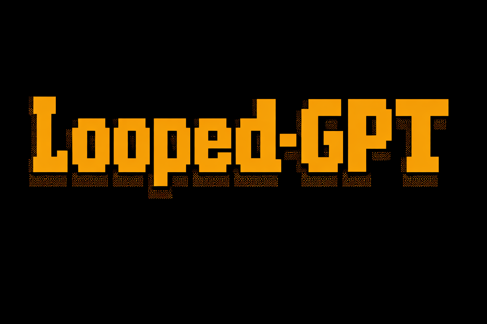
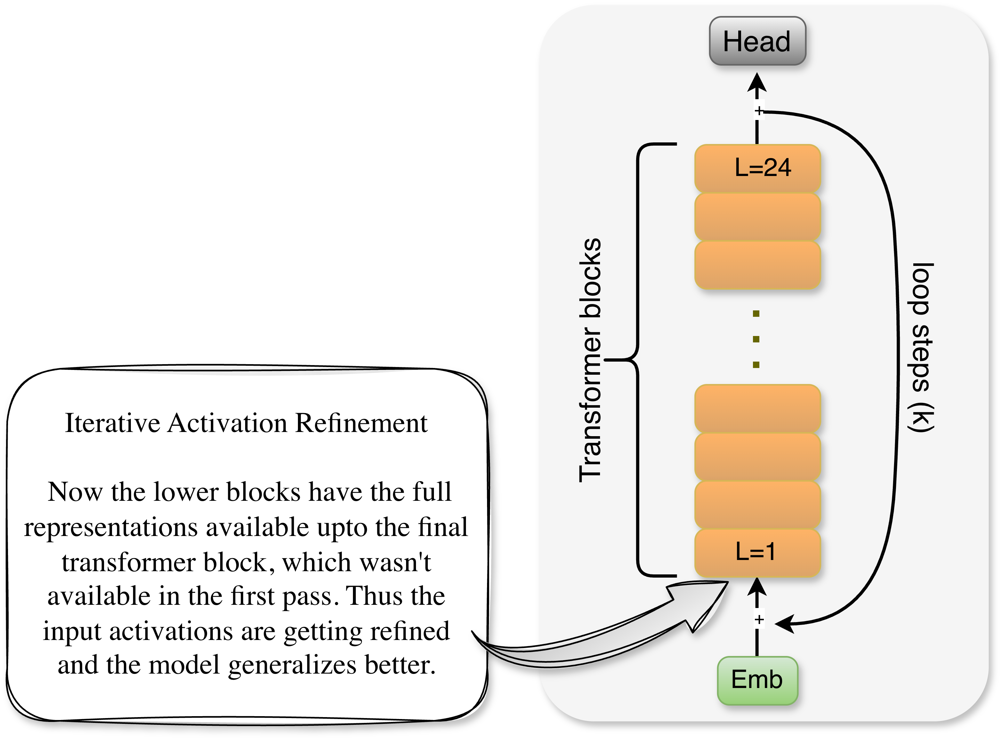
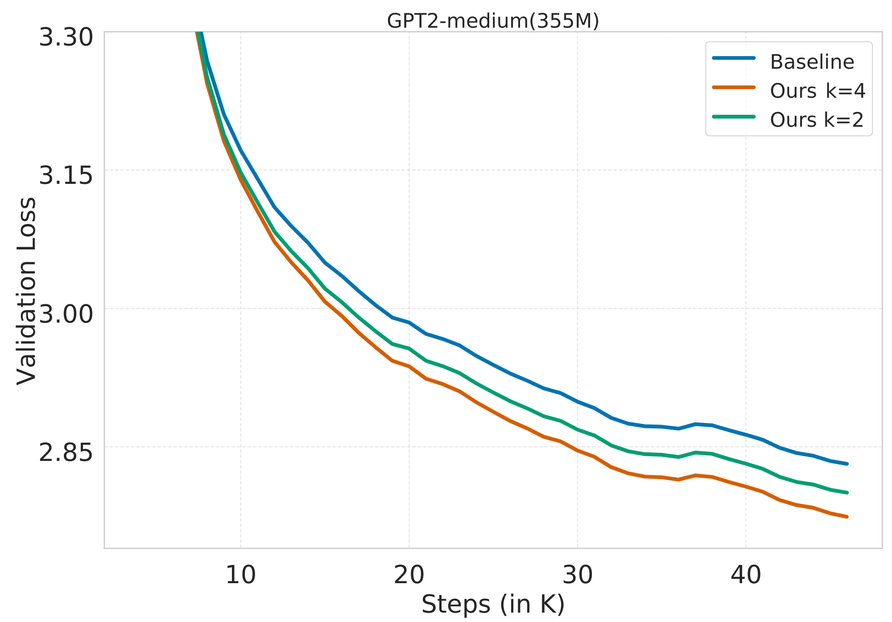
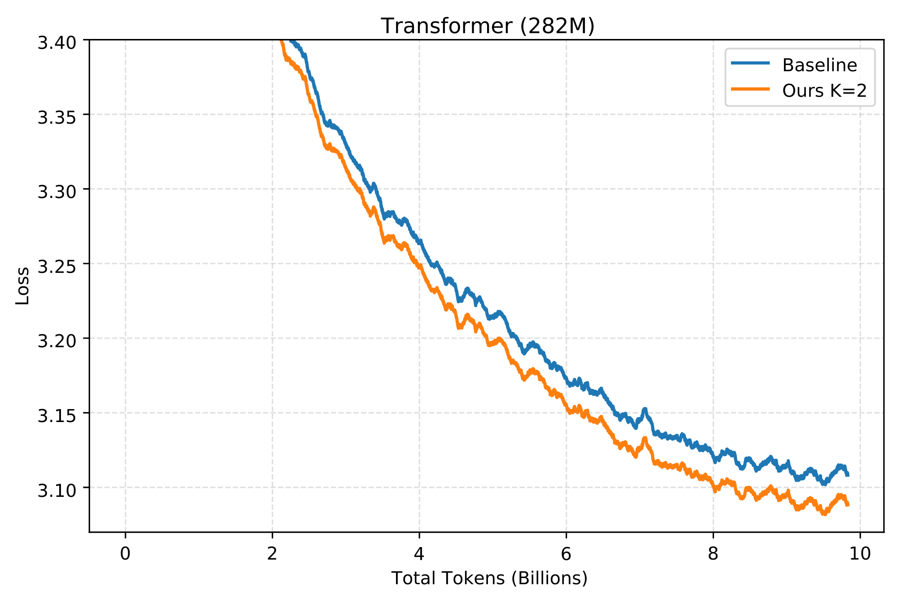

# Looped-GPT

---
<p align="left">
  
</p>

**Looped-GPT** is a minimal, lightweight, and highly hackable implementation of **Looped Transformer** built on top of GPT architecture.

---

<p align="left">
  
  <br>
  <em><strong>Figure 1.</strong> Looped-GPT architecture visualization.</em>
</p>

---

## Looped-GPT Pre-Training

Looped-GPT has **reverse residual connection** that feeds the output of the final transformer block (layer) back into the input embedding. 
Unlike standard Transformer residuals, which operate in the forward direction by connecting a module’s input to its output or 
by connecting early layers to deeper ones via highway connections, Looped-GPT reverses this flow: a deeper representation is 
residually injected into a lower layer. During training, the model performs (K) forward passes i.e. K-1 refinement steps followed by a final forward pass and a single backward pass, 
using **backpropagation through depth (BPTD)** without truncation.


### Forward Pass (Pseudocode)
```
# Input
x = token_embeddings + position_embeddings

# Refinement Phase: (K-1) iterations
for i = 1 to (K-1):
    h = x
    h = TransformerBlocks(h)  # Pass through all N layers
    x = x + h  # Reverse Residual connection

# Final Pass: Kth iteration
h = x
h = TransformerBlocks(h)  # Pass through all N layers
h = LayerNorm(h)
logits = LanguageModelHead(h)

# Total forward passes through transformer: K times
# Total layers processed: K × N (where N = number of transformer blocks)
```


### Backward Pass with Backpropagation through Depth (Pseudocode) 
```
# Compute loss gradient
dL/dlogits = LossGradient(logits, targets)

Gradients flow through all K iterations via reverse residual connection.

# Complexity:
# - Computation Graph: K × Standard GPT
# - Memory Overhead:  K × Standard GPT
```
Note: The algorithm is known as Backpropagation through Time (BPTT) but since we are performing depth-wise 
recurrence and not timewise recurrence we call this BPTD. We have not applied any truncation during backprop which means no stop-grad.

---

## Pre-training Results (355M GPT2 model with OpenWebText)

We trained a standard GPT-2 model with 355M parameters (**Baseline**) on OpenWebText which has 9B unique tokens. 
The model was trained with an effective batch size of 394K tokens and processed 15.73B tokens in total via data repetition. 
We then trained two same-size Looped-GPT (355M) variants (**Ours**) with loop steps \(K = 2\) and \(K = 4\), using the same number of training steps 
and the same overall token budget. Refer Figure 2 below, it can be seen that GPT models (**Ours**) with looping mechanism achieves 
higher generalization compared to the baseline. This experiment is fully reproducible using the given codebase.


<p align="left">
  
  <br>
  <em><strong>Figure 2.</strong> Validation loss vs. training steps for a standard GPT-2 Medium (355M) model (<strong>Baseline</strong>) and same-size Looped-GPT models (<strong>Ours</strong>) with loop steps K = 2 and K = 4. 
All models are trained on OpenWebText for 40K steps (15.73B tokens) under similar training configurations.</em>
</p>

## Pre-training Results (282M LLAMA with Fineweb)

We additionally pre-trained a language model with the LLAMA architecture at 282M parameters. 
We used a batch size of 131K tokens from the FineWeb education subset with 10B total tokens. 
We pre-trained a standard LLAMA model (**Baseline**) and a Looped-LLAMA (**Ours**). 
In **Figure 3**, we report total tokens versus training loss. We observe a thematically similar result (compared to Figure 2), 
where Looped-LLAMA outperforms the baseline. This experiment is not reproducible using this codebase, as the repository is intentionally kept minimal for simplicity.

<p align="left">
  
  <br>
  <em><strong>Figure 3.</strong> Train loss vs. total tokens (in billions) for a standard LLAMA (282M) model (<strong>Baseline</strong>) and same-size Looped-LLAMA model (<strong>Ours</strong>) with loop steps K = 2. 
All models are trained on Fineweb for 10B tokens (75K steps) under similar training configurations.</em>
</p>

---

## Intuition: Why Looping leads to better generalization?

- **Architectural perspective :** The reverse residual connection from deeper layers to early layers provides a unique opportunity to the early transformer blocks. 
During the looping mechanism, the early blocks process the tokens not just with the representations found below them, 
but also the nuanced representations provided by the deeper layers. This whole process of multiple looping steps can be seen has iterative activation refinement (Refer Figure 1).

- **Optimization perspective :** Recall residual connections acts as smoothing operators for the [loss landscapes](https://arxiv.org/abs/1712.09913). 
The standard GPT's loss landscape should be more jacked up compared it's Looped counterpart. Hence we can intuitively assume that loss landscape should be less jacked up compared to
standard GPT.

---

## Reproduce Our Results

### Dependencies

- Python 3.10
- Pytorch 2.5
- datasets
- tiktoken

### Prepare Data

Prepare the [OpenWebText](https://huggingface.co/datasets/openwebtext) data following [nanoGPT](https://github.com/karpathy/nanoGPT/):
```
$ python data/openwebtext/prepare.py
```

### Train Looped-GPT (Single GPU)

```
$ python train.py
```

---

## Limitations of this Codebase

- This codebase is not optimized for inference.
- This pre-training approach may require additional compute; however, this is also true for other architectures such as MoEs. If an architecture or training recipe achieves consistently better generalization, it deserves 
to be studied carefully despite higher compute costs.

---

## References (Extended Reading)

- [Universal Transformers](https://arxiv.org/abs/1807.03819)
- [Scaling up Test-Time Compute with Latent Reasoning: A Recurrent Depth Approach
](https://arxiv.org/abs/2502.05171)
- [Scaling Latent Reasoning via Looped Language Models](https://arxiv.org/abs/2510.25741)
- [Pretraining Language Models to Ponder in Continuous Space](https://arxiv.org/abs/2505.20674)

---

## Acknowledgements

- This codebase is extended following [nanoGPT](https://github.com/karpathy/nanoGPT/).

## Citation

```bibtex
@misc{Looped-GPT,
  author = {Sunny Sanyal},
  title = {Looped-GPT: minimal, lightweight, and highly hackable implementation of Looped Transformers built on top of GPT architecture},
  year = {2026},
  publisher = {GitHub},
  url = {https://github.com/sanyalsunny111/Looped-GPT}
}
```

## License

MIT